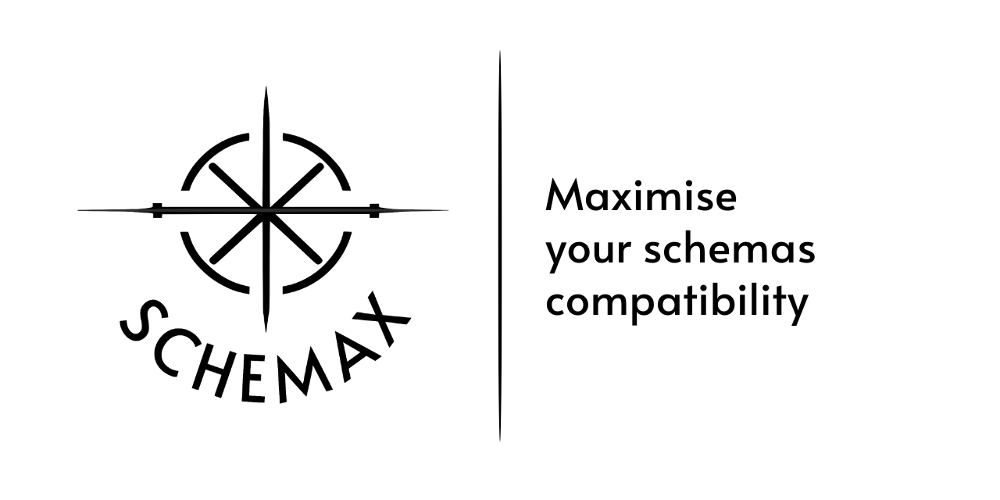
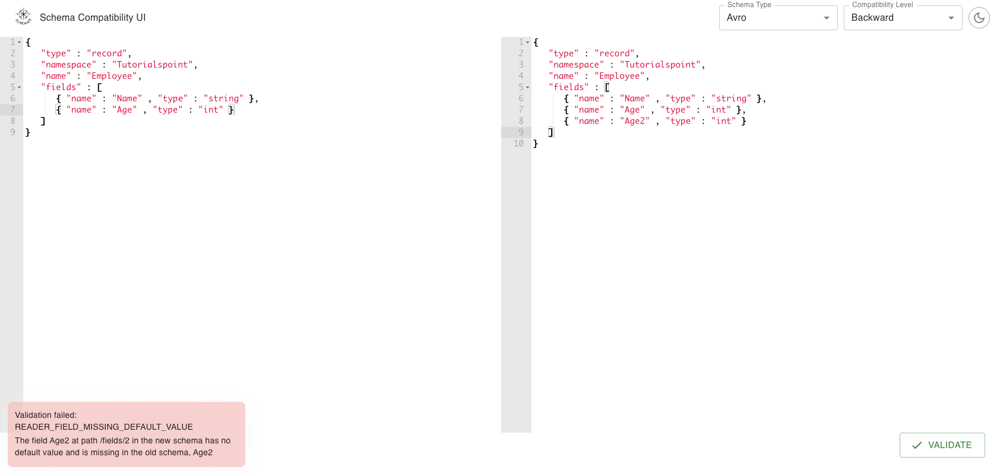

**Versatile, fast and lightweight web UI for validating schema compatibility levels in Confluent Schema Registry.**

## Description

This application serves as a versatile web user interface. It is designed to validate schema compatibility levels,
primarily focusing on the Confluent Schema Registry.

The application is characterized by its speed, ensuring quick responses and efficient operations. This makes it an ideal
tool for developers and teams working in fast-paced environments.

Despite its comprehensive functionality, the application remains lightweight. It does not consume
excessive system resources, ensuring that it can run smoothly even on systems with limited capabilities.

In addition to the Confluent Schema Registry, the application is also compatible with other schema registries. This
broad compatibility makes it a flexible tool that can be integrated into a variety of development workflows.



## Build

To build the full application including autogenerated code from OpenAPI, run the following command in the root of the
repository. This will also execute tests.

```bash
make build
```

The build command will generate a fat jar with backend and front-end included in one, which can be run using Java.

```bash
java -jar api/target/schemax-<version>.jar
```

It is also possible to run it without executing tests:

```bash
make build-no-test
```

## Docker

To build the Docker image, run the following command in the root of the repository.

```bash
make build-docker
```
